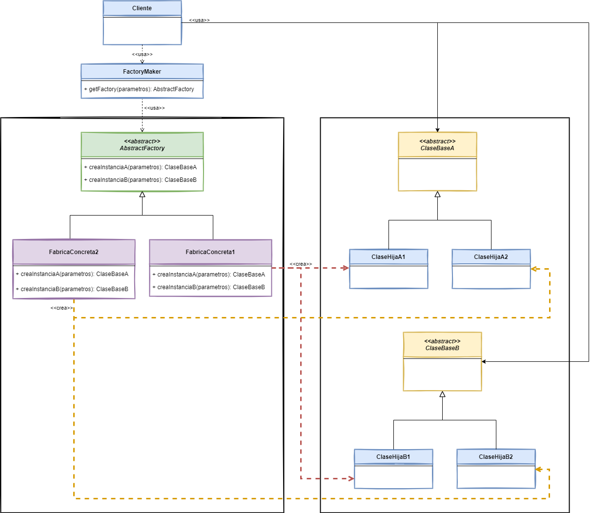

# Abstract Factory

## 👋 Bienvenid@s

Este repositorio contiene los ejemplos de código de la implementación del patrón de diseño [*Abstract Factory*](https://www.javatutoriales.com/2021/12/patron-de-diseno-abstract-factory.html).

Para ver el tutorial completo, con la explicación detallada del patrón, entra al Blog:
[JavaTutoriales](https://www.javatutoriales.com/2021/12/patron-de-diseno-abstract-factory.html)

En el tutorial doy una explicación y muestro la implementación del patrón.

Aquí dejo un breve (muy breve) resumen del mismo.

## 🎯 Objetivo de *Abstract Factory*

- Tener una interface para crear una **familia de objetos relacionados** o dependientes, sin especificar sus clases de forma explícita.

## 📑 Diagrama

## ⚙️Requerimientos
El proyecto está desarrollado usando **Java 17** y **Gradle 7.3**, pero no uso ninguna característica particular de esta versión, por lo que deberías poder ejectarlo en cualquier versión de Java.

## 💻 Explicación
Para ver el tutorial completo, con la explicación detallada del patrón, entra al Blog:
[JavaTutoriales](https://www.javatutoriales.com/2021/12/patron-de-diseno-abstract-factory.html)